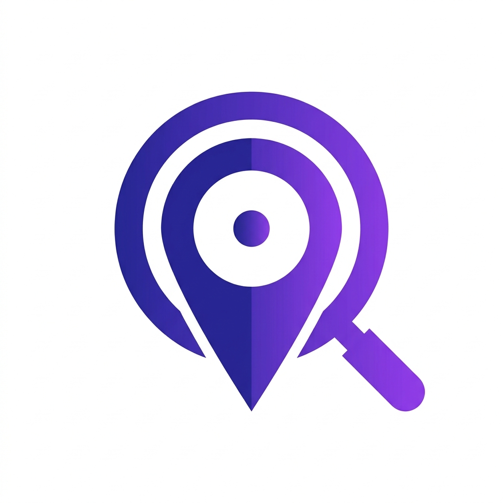
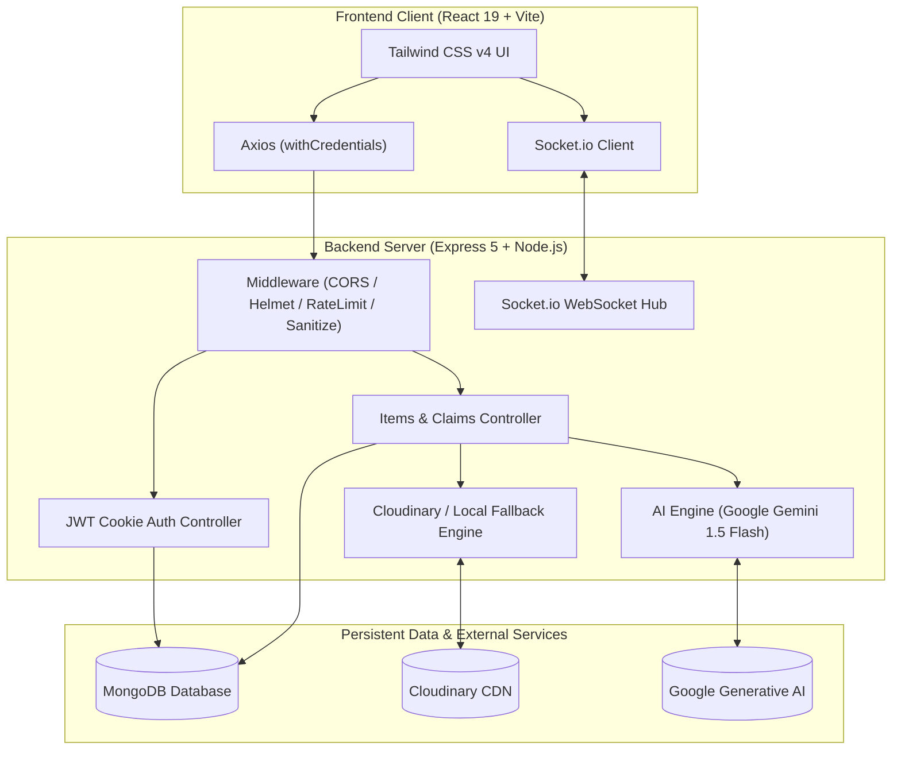

<div align="center">

  

  # 🔍 Lost2Found

  **Smart, AI-Powered Campus Lost & Found Platform**

  *Connecting lost items with their rightful owners using Google Gemini AI, real-time WebSockets, and privacy-first student workflows.*

  <p align="center">
    <a href="https://github.com/Shyaman014/Lost2Found/stargazers"></a>
    <a href="https://github.com/Shyaman014/Lost2Found/network/members"></a>
    <a href="https://github.com/Shyaman014/Lost2Found/issues"></a>
    <a href="https://github.com/Shyaman014/Lost2Found/blob/main/LICENSE"></a>
  </p>

  <p align="center">
    
    
    
    
    
    
    
    
  </p>

  <p align="center">
    <a href="#-key-features">Key Features</a> •
    <a href="#-system-architecture">Architecture</a> •
    <a href="#-tech-stack">Tech Stack</a> •
    <a href="#-getting-started">Getting Started</a> •
    <a href="#-api-endpoints">API Docs</a> •
    <a href="#-security--privacy">Security</a> •
    <a href="#-deployment">Deployment</a>
  </p>

</div>

---

## 📖 Overview

Lost items on university campuses are often scattered across disconnected social media groups, bulletin boards, and campus security offices.

**Lost2Found** modernizes this experience with an intelligent, campus-verified web platform. When a student reports a lost or found item, **Google Gemini Multimodal AI** compares images, titles, categories, and descriptions to compute automated similarity scores. To protect student privacy, finders and claimants communicate via **end-to-end real-time anonymous chat** powered by **Socket.io**—eliminating the need to exchange phone numbers or social media handles before ownership is proven.

---

## ✨ Key Features

| Feature | Description |
| :--- | :--- |
| 🤖 **Multimodal AI Matching** | Uses **Google Gemini AI** to cross-analyze lost and found listings across visual attributes, keywords, locations, and brands to generate instant match confidence scores (`0-100%`). |
| 🔒 **Privacy-Preserving Chat** | Real-time anonymous messaging powered by **Socket.io** allows finders and claimants to communicate safely without revealing personal contact details. |
| 🛡️ **Verified Ownership Claims** | Multi-step claims pipeline requiring specific proof of ownership (secret marks, serial numbers, unique identification) before handover is approved. |
| ⚡ **Modern Responsive Experience** | Sleek UI built with **React 19**, **Vite**, and **Tailwind CSS v4** featuring glassmorphism, micro-animations, quick filters, and mobile drawer navigation. |
| 📊 **Admin Moderation & Insights** | Comprehensive administrative dashboard featuring platform health metrics, flagged item moderation, user account controls, and return rate analytics. |
| 📸 **Cloud & Local Storage Resiliency** | Seamless image uploads via **Cloudinary** with built-in automatic local storage fallback for development and self-hosted environments. |
| 🔐 **Defense-in-Depth Security** | Hardened with **HttpOnly SameSite JWT cookies**, **Helmet** with CORS/CORP headers, **Mongo sanitize** against injection, and IP-based **Rate Limiting**. |

---

## 🏛️ System Architecture



---

## 🔄 Claims & Return Lifecycle

```mermaid
sequenceDiagram
    autonumber
    actor Owner as Student (Lost Item)
    actor Finder as Student (Found Item)
    participant Platform as Lost2Found Platform
    participant Gemini as Gemini AI Engine

    Finder->>Platform: Report Found Item (with photo)
    Platform->>Gemini: Trigger Multimodal AI Match Analysis
    Gemini-->>Platform: Match Score calculated & indexed
    Platform-->>Owner: Alert of Potential Match (> 70%)
    Owner->>Platform: Submit Ownership Claim (evidence/details)
    Platform-->>Finder: Claim Notification Received
    Finder->>Platform: Open Anonymous Chat
    Owner<->Finder: Anonymous Verification Chat (WebSockets)
    Finder->>Platform: Approve Claim & Schedule Handover
    Finder->>Platform: Mark as "Physically Returned"
    Platform-->>Owner: Confirmation & Case Closed
```

---

## 🛠️ Tech Stack

### Frontend
- **Core:** [React 19](https://react.dev/) with [Vite](https://vite.dev/)
- **Styling:** [Tailwind CSS v4](https://tailwindcss.com/) with PostCSS & Autoprefixer
- **Routing:** [React Router DOM v7](https://reactrouter.com/)
- **Networking:** [Axios](https://axios-http.com/) (configured with automatic cookie credentials)
- **WebSockets:** [Socket.io Client](https://socket.io/)
- **Tooling:** [Oxlint](https://oxc-project.github.io/)

### Backend
- **Runtime:** [Node.js](https://nodejs.org/) (ES Modules)
- **Web Framework:** [Express.js v5](https://expressjs.com/)
- **Database & ODM:** [MongoDB](https://www.mongodb.com/) with [Mongoose v9](https://mongoosejs.com/)
- **Real-Time:** [Socket.io](https://socket.io/) WebSockets
- **Artificial Intelligence:** [@google/generative-ai](https://ai.google.dev/) (Gemini 1.5 Flash)
- **Media Uploads:** [Cloudinary SDK](https://cloudinary.com/) + [Multer](https://github.com/expressjs/multer)

### Security & Hardening
- **Authentication:** `jsonwebtoken` (JWT stored in secure `HttpOnly` / `SameSite` cookies) & `bcryptjs`
- **Headers:** `helmet` with custom `Cross-Origin-Resource-Policy: cross-origin`
- **Protection:** `express-mongo-sanitize` for NoSQL injection prevention & `express-rate-limit`
- **Access Control:** Role-Based Access Control (Student vs. Administrator)

---

## 📁 Repository Structure

```text
Lost2Found/
├── client/                     # Frontend SPA (React 19 + Vite + Tailwind v4)
│   ├── public/                 # Static assets (logo.jpg, favicon.svg)
│   ├── src/
│   │   ├── components/         # Reusable UI & modal components
│   │   │   ├── admin/          # Admin moderation & confirmation dialogs
│   │   │   ├── chat/           # Real-time ChatWindow & conversation items
│   │   │   └── items/          # MatchCard, ItemCard, ItemForm
│   │   ├── context/            # Global state (AuthContext, SocketContext)
│   │   ├── layouts/            # Page layouts (Navbar, AdminLayout)
│   │   ├── pages/              # Routes (Home, Items, Report, Profile, Admin)
│   │   └── services/           # API integration clients (api, auth, item, claim)
│   ├── index.html              # Entry HTML with dynamic platform branding
│   └── package.json
│
├── server/                     # Backend API & WebSocket Server (Express 5)
│   ├── config/                 # Database, Socket.io, and Cloudinary configuration
│   ├── controllers/            # Request handlers (auth, item, claim, ai, admin)
│   ├── middleware/             # Auth guards, upload validation, rate limiting
│   ├── models/                 # Mongoose schemas (User, Item, Claim, Message)
│   ├── public/uploads/         # Local file storage fallback
│   ├── routes/                 # RESTful API route definitions
│   ├── services/               # AI matching service, Cloudinary uploader
│   ├── app.js                  # Express app middleware assembly
│   ├── server.js               # HTTP + WebSocket server bootstrap
│   └── package.json
│
├── package.json                # Root orchestration workspace
└── README.md
```

---

## 🚀 Getting Started

### Prerequisites
Make sure you have installed:
- **Node.js**: v18.0.0 or higher
- **MongoDB**: A running local instance or free [MongoDB Atlas](https://www.mongodb.com/atlas) cluster
- **Google Gemini API Key**: Get a free key from [Google AI Studio](https://aistudio.google.com/)
- *(Optional)* **Cloudinary Account**: For cloud media hosting (local fallback works out-of-the-box)

---

### Quickstart (Single Command)

From the project root:

```bash
# 1. Clone repository
git clone https://github.com/Shyaman014/Lost2Found.git
cd Lost2Found

# 2. Install all dependencies (root, server, and client)
npm run install-all

# 3. Configure environment variables (see below)
# (Create server/.env and client/.env)

# 4. Start both client and server concurrently in development mode
npm run dev
```

---

### Environment Configuration

#### 1. Server Configuration (`server/.env`)
Create a `.env` file in the `server` directory:

```env
PORT=5000
NODE_ENV=development
CLIENT_URL=http://localhost:5173
BACKEND_URL=http://localhost:5000

# Database
MONGO_URI=mongodb://localhost:27017/lost2found

# Security & Session
JWT_SECRET=your_super_secret_jwt_key_here
JWT_EXPIRES_IN=30d

# Google Gemini AI
GEMINI_API_KEY=your_gemini_api_key_here
GEMINI_MODEL=gemini-1.5-flash
AI_MATCH_THRESHOLD=70

# Cloudinary (Optional - leaves local upload fallback active if blank)
CLOUDINARY_CLOUD_NAME=your_cloudinary_cloud_name
CLOUDINARY_API_KEY=your_cloudinary_api_key
CLOUDINARY_API_SECRET=your_cloudinary_api_secret
```

#### 2. Client Configuration (`client/.env`)
Create a `.env` file in the `client` directory:

```env
VITE_API_BASE_URL=http://localhost:5000/api
```

---

## 📡 API Endpoints

### 🔐 Authentication (`/api/auth`)
| Method | Endpoint | Description | Access |
| :--- | :--- | :--- | :--- |
| `POST` | `/api/auth/register` | Register a new student account | Public |
| `POST` | `/api/auth/login` | Authenticate with credentials and set cookie | Public |
| `POST` | `/api/auth/demo` | Instant 1-click test login for reviewers | Public |
| `POST` | `/api/auth/logout` | Clear session cookie | Public |
| `GET` | `/api/auth/me` | Fetch active user profile | Private |
| `PUT` | `/api/auth/profile` | Update user info & profile picture (`FormData`) | Private |

### 📦 Items (`/api/items`)
| Method | Endpoint | Description | Access |
| :--- | :--- | :--- | :--- |
| `GET` | `/api/items` | List items with search, filters, and pagination | Public |
| `POST` | `/api/items` | Report a lost or found item (with image upload) | Private |
| `GET` | `/api/items/:id` | Fetch detailed item record | Public |
| `PUT` | `/api/items/:id` | Update an existing report | Private (Owner) |
| `DELETE` | `/api/items/:id` | Remove an item report | Private (Owner/Admin) |
| `PATCH` | `/api/items/:id/status` | Mark item status (`active` / `resolved`) | Private (Owner) |
| `PATCH` | `/api/items/:id/returned`| Mark claimed item as physically returned | Private (Finder) |

### 🤝 Claims & AI Matches
| Method | Endpoint | Description | Access |
| :--- | :--- | :--- | :--- |
| `POST` | `/api/items/:id/claims` | File an ownership claim with evidence | Private |
| `GET` | `/api/items/:id/claims` | View incoming claims for an item | Private (Finder) |
| `GET` | `/api/claims/my` | View all claims filed by logged-in user | Private |
| `PATCH` | `/api/claims/:id/approve` | Approve ownership claim | Private (Finder) |
| `PATCH` | `/api/claims/:id/reject` | Reject ownership claim | Private (Finder) |
| `POST` | `/api/items/:id/match` | Re-run Gemini AI matching on demand | Private |
| `GET` | `/api/items/:id/matches`| Retrieve potential matching items | Private |

### 💬 Messaging & Admin (`/api/conversations` & `/api/admin`)
| Method | Endpoint | Description | Access |
| :--- | :--- | :--- | :--- |
| `GET` | `/api/conversations` | List user's active anonymous chat threads | Private |
| `GET` | `/api/conversations/:id` | Retrieve messages for a conversation | Private |
| `GET` | `/api/admin/analytics/overview` | Platform health metrics & resolution stats | Admin |
| `GET` | `/api/admin/users` | Manage registered accounts | Admin |
| `PATCH` | `/api/admin/users/:id/status` | Toggle user ban/active status | Admin |
| `GET` | `/api/admin/reports` | View flagged item reports | Admin |

---

## 🔒 Security & Privacy

- **Strict Token Transport:** JWTs are delivered inside `HttpOnly`, `SameSite=lax` (or `strict` in production) cookies, mitigating XSS token theft.
- **Push Protection Compliance:** All committed `.env.example` templates use placeholders (`your_*_here`) to prevent secret leakage.
- **Resource Isolation:** Helmet configured with `Cross-Origin-Resource-Policy: cross-origin` allows local and cloud assets to render safely without exposing unauthorized endpoints.
- **Rate Limiting:** Built-in IP-based rate limiting on sensitive routes (authentication, claim submissions, search) to prevent abuse and brute force attempts.

---

## 🌐 Deployment

### Frontend (Vercel / Netlify)
1. Import repository and set directory to `client`.
2. Build Command: `npm run build`
3. Output Directory: `dist`
4. Set environment variable: `VITE_API_BASE_URL=https://your-backend-domain.com/api`

### Backend (Render / Railway / VPS)
1. Import repository and set directory to `server`.
2. Build Command: `npm install`
3. Start Command: `node server.js`
4. Set production environment variables (`NODE_ENV=production`, `CLIENT_URL=https://your-frontend-domain.com`, `MONGO_URI`, `JWT_SECRET`, `GEMINI_API_KEY`).

---

## 🤝 Contributing

Contributions make the open-source community an inspiring place to learn, inspire, and create:

1. Fork the Project
2. Create your Feature Branch (`git checkout -b feature/AmazingFeature`)
3. Commit your Changes (`git commit -m 'feat: add some amazing feature'`)
4. Push to the Branch (`git push origin feature/AmazingFeature`)
5. Open a Pull Request

---

## 📄 License

Distributed under the **MIT License**. See [`LICENSE`](LICENSE) for more information.

---

<div align="center">
  <sub>Built with ❤️ by <a href="https://github.com/Shyaman014">Shyaman014</a> for college communities worldwide.</sub>
</div>
