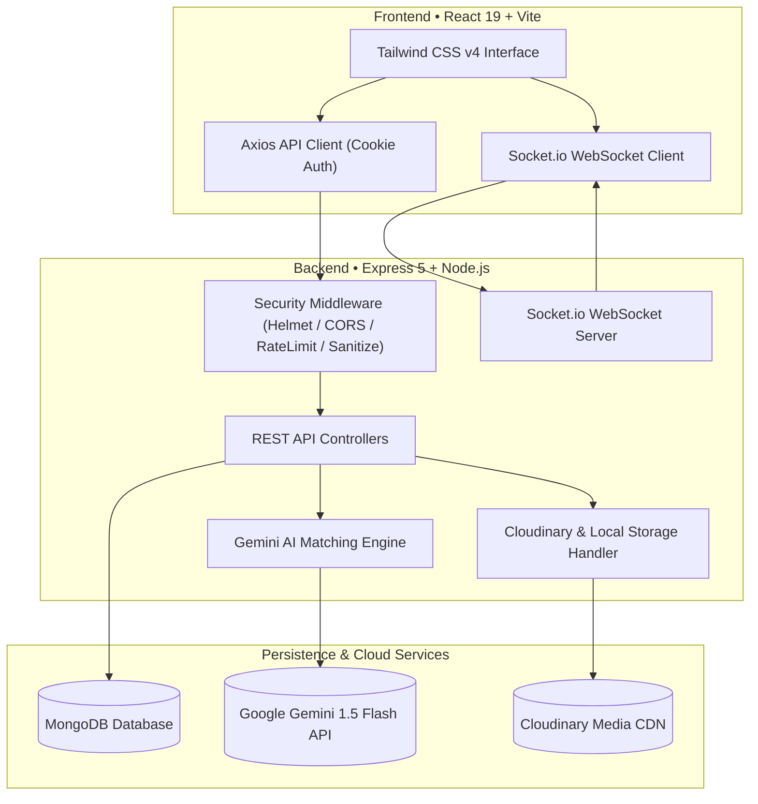

<div align="center">

  

  # Lost2Found
  ### Smart, AI-Powered Campus Lost & Found Platform

  *An intelligent, full-stack campus utility that connects lost items with verified owners using Google Gemini multimodal AI, real-time anonymous chat, and a fraud-resistant claims workflow.*

  <br />

  <p align="center">
    <a href="https://github.com/Shyaman014/Lost2Found/stargazers"></a>
    <a href="https://github.com/Shyaman014/Lost2Found/network/members"></a>
    <a href="https://github.com/Shyaman014/Lost2Found/issues"></a>
    <a href="https://github.com/Shyaman014/Lost2Found/blob/main/LICENSE"></a>
  </p>

  <p align="center">
    
    
    
    
    
    
    
    
  </p>

  <br />

  <p align="center">
    <a href="#-table-of-contents"><strong>Explore the Docs »</strong></a>
    <br />
    <br />
    <a href="#-key-features">Key Features</a> •
    <a href="#-system-architecture">Architecture</a> •
    <a href="#-tech-stack">Tech Stack</a> •
    <a href="#-getting-started">Getting Started</a> •
    <a href="#-api-reference">API Reference</a> •
    <a href="#-security--privacy">Security</a>
  </p>

</div>

---

## 📑 Table of Contents

- [Overview](#-overview)
- [Key Features](#-key-features)
- [System Architecture](#-system-architecture)
- [Tech Stack](#-tech-stack)
- [Project Structure](#-project-structure)
- [Getting Started](#-getting-started)
  - [Prerequisites](#prerequisites)
  - [Quickstart (Single Command)](#quickstart-single-command)
  - [Environment Configuration](#environment-configuration)
- [API Reference](#-api-reference)
  - [Authentication](#authentication-apiauth)
  - [Items Management](#items-management-apiitems)
  - [Claims & AI Matching](#claims--ai-matching-apiclaims--apiitemsidmatch)
  - [Messaging & Admin](#messaging--admin-apiconversations--apiadmin)
- [Real-Time WebSockets](#-real-time-websockets)
- [Security & Privacy](#-security--privacy)
- [Deployment](#-deployment)
- [Contributing](#-contributing)
- [License](#-license)

---

## 💡 Overview

Managing lost property on campus is traditionally fragmented across informal WhatsApp groups, social feeds, and security helpdesks. Items frequently remain unclaimed or get handed to unverified claimants.

**Lost2Found** replaces this friction with a unified, modern web application:
- **Multimodal AI Similarity**: Reports are processed by **Google Gemini 1.5 Flash**, evaluating titles, categories, visual markers, and uploaded imagery to calculate a confidence match score (`0-100%`).
- **Privacy-Preserving Verification**: Built-in real-time anonymous chat enables finders and claimants to communicate securely without exchanging personal phone numbers or social profiles.
- **Auditable Ownership Pipeline**: A structured verification workflow ensures proof (secret serial numbers, unique identifiers, purchase proofs) before items are marked as physically returned.

---

## 🌟 Key Features

| Category | Feature | Description |
| :--- | :--- | :--- |
| 🤖 **Artificial Intelligence** | **Multimodal Matching** | Automated similarity calculation using Google Gemini to link lost items with found items based on visual and textual descriptions. |
| 💬 **Communication** | **Anonymous Real-Time Chat** | Direct finder-to-claimant WebSocket messaging powered by Socket.io, protecting student privacy until ownership is verified. |
| 🛡️ **Verification** | **Evidence Claims Flow** | Claimants submit distinctive identifying details to prevent fraudulent pickups. |
| 🔍 **Discovery** | **Search & Smart Filters** | Instant search with category filters, status filters (`Lost`, `Found`, `Claimed`, `Returned`), sorting, and pagination. |
| 📱 **Design & UI** | **Modern Responsive UI** | Built with React 19, Vite, and Tailwind CSS v4 featuring glassmorphism, micro-animations, and mobile-friendly navigation. |
| 📊 **Administration** | **Moderation & Analytics** | Admin dashboard to review platform health, moderate flagged items, manage accounts, and view recovery rates. |
| 🔒 **Authentication** | **Secure Session Handling** | JWT authentication delivered through `HttpOnly` and `SameSite` cookies with role-based authorization (Student vs. Admin). |

---

## 🏛️ System Architecture



---

## 🛠️ Tech Stack

### Frontend
- **Framework:** [React 19](https://react.dev/)
- **Build Tool:** [Vite](https://vite.dev/)
- **Styling:** [Tailwind CSS v4](https://tailwindcss.com/) with PostCSS & Autoprefixer
- **Routing:** [React Router DOM v7](https://reactrouter.com/)
- **HTTP Client:** [Axios](https://axios-http.com/)
- **Real-Time Client:** [Socket.io Client](https://socket.io/)
- **Linter:** [Oxlint](https://oxc-project.github.io/)

### Backend
- **Runtime:** [Node.js](https://nodejs.org/) (ES Modules)
- **Web Framework:** [Express.js v5](https://expressjs.com/)
- **Database & ODM:** [MongoDB](https://www.mongodb.com/) with [Mongoose v9](https://mongoosejs.com/)
- **AI Engine:** [@google/generative-ai](https://ai.google.dev/) (Gemini 1.5 Flash)
- **Real-Time Engine:** [Socket.io](https://socket.io/)
- **Media Uploads:** [Cloudinary](https://cloudinary.com/) + [Multer](https://github.com/expressjs/multer) (with automatic local filesystem fallback)

### Security & Compliance
- **Session Security:** `jsonwebtoken` with `HttpOnly` and `SameSite` cookie delivery
- **Password Protection:** `bcryptjs` salted hashing
- **Header Security:** `helmet` with `Cross-Origin-Resource-Policy: cross-origin`
- **Data Protection:** `express-mongo-sanitize` (NoSQL injection prevention) & `express-rate-limit`

---

## 📂 Project Structure

```text
Lost2Found/
├── client/                     # Frontend Application (React 19 + Vite)
│   ├── public/                 # Static assets (logo.jpg, favicon.svg)
│   ├── src/
│   │   ├── components/         # Modular UI components
│   │   │   ├── admin/          # Admin moderation & modal dialogs
│   │   │   ├── chat/           # Live ChatWindow & message bubbles
│   │   │   └── items/          # MatchCard, ItemCard, ItemForm
│   │   ├── context/            # Global React Context (AuthContext, SocketContext)
│   │   ├── layouts/            # Layout wrappers (Navbar, AdminLayout)
│   │   ├── pages/              # Primary routes (Home, Items, Report, Profile, Admin)
│   │   └── services/           # Axios service clients (api, auth, item, claim)
│   ├── index.html              # HTML entry point with dynamic tab branding
│   └── package.json
│
├── server/                     # Backend Application (Express 5 + Socket.io)
│   ├── config/                 # Database, Socket.io, and Cloudinary configuration
│   ├── controllers/            # Controller business logic (auth, item, claim, ai, admin)
│   ├── middleware/             # Auth guards, upload validation, rate limits, error handlers
│   ├── models/                 # Mongoose schemas (User, Item, Claim, Message)
│   ├── public/uploads/         # Local file storage fallback for development
│   ├── routes/                 # RESTful route definitions
│   ├── services/               # AI matching service & Cloudinary uploader
│   ├── app.js                  # Express middleware configuration
│   ├── server.js               # HTTP & WebSocket server entry point
│   └── package.json
│
├── package.json                # Root orchestration workspace
└── README.md
```

---

## 🚀 Getting Started

### Prerequisites
- **Node.js**: v18.0.0 or higher
- **MongoDB**: Local MongoDB instance or free [MongoDB Atlas](https://www.mongodb.com/atlas) cluster
- **Google Gemini API Key**: Free key from [Google AI Studio](https://aistudio.google.com/)

---

### Quickstart (Single Command)

From the project root:

```bash
# 1. Clone repository
git clone https://github.com/Shyaman014/Lost2Found.git
cd Lost2Found

# 2. Install all dependencies (root, server, and client)
npm run install-all

# 3. Setup environment variables (see below)
# Create server/.env and client/.env

# 4. Start both client and server concurrently
npm run dev
```

The application will be available at:
- **Frontend:** `http://localhost:5173`
- **Backend:** `http://localhost:5000`

---

### Environment Configuration

#### 1. Server Configuration (`server/.env`)
Create a `.env` file inside the `server/` directory:

```env
PORT=5000
NODE_ENV=development
CLIENT_URL=http://localhost:5173
BACKEND_URL=http://localhost:5000

# Database Connection
MONGO_URI=mongodb://localhost:27017/lost2found

# Authentication & JWT
JWT_SECRET=your_jwt_secret_key_here
JWT_EXPIRES_IN=30d

# Google Gemini AI
GEMINI_API_KEY=your_gemini_api_key_here
GEMINI_MODEL=gemini-1.5-flash
AI_MATCH_THRESHOLD=70

# Cloudinary Media Storage (Optional: fallback stores locally)
CLOUDINARY_CLOUD_NAME=your_cloudinary_cloud_name
CLOUDINARY_API_KEY=your_cloudinary_api_key
CLOUDINARY_API_SECRET=your_cloudinary_api_secret
```

#### 2. Client Configuration (`client/.env`)
Create a `.env` file inside the `client/` directory:

```env
VITE_API_BASE_URL=http://localhost:5000/api
```

---

## 📡 API Reference

### Authentication (`/api/auth`)
| Method | Route | Description | Access |
| :--- | :--- | :--- | :--- |
| `POST` | `/register` | Register a new student account | Public |
| `POST` | `/login` | Authenticate user and issue `HttpOnly` JWT cookie | Public |
| `POST` | `/demo` | Instant 1-click test login for review & evaluation | Public |
| `POST` | `/logout` | Invalidate and clear JWT cookie | Public |
| `GET` | `/me` | Fetch currently authenticated user profile | Private |
| `PUT` | `/profile` | Update user details and profile photo (`FormData`) | Private |

### Items Management (`/api/items`)
| Method | Route | Description | Access |
| :--- | :--- | :--- | :--- |
| `GET` | `/` | List items with search, filters, sorting, and pagination | Public |
| `POST` | `/` | Report a lost or found item with image attachment | Private |
| `GET` | `/:id` | Fetch specific item report details | Public |
| `PUT` | `/:id` | Update an existing item report | Private (Owner) |
| `DELETE` | `/:id` | Remove an item report | Private (Owner/Admin) |
| `PATCH` | `/:id/status` | Update item status (`active` / `resolved`) | Private (Owner) |
| `PATCH` | `/:id/returned` | Mark claimed item as physically returned | Private (Finder) |

### Claims & AI Matching (`/api/claims` & `/api/items/:id/match`)
| Method | Route | Description | Access |
| :--- | :--- | :--- | :--- |
| `POST` | `/items/:id/claims` | File an ownership claim with evidence | Private |
| `GET` | `/items/:id/claims` | View incoming claims for an item | Private (Finder) |
| `GET` | `/claims/my` | View all claims filed by the current user | Private |
| `PATCH` | `/claims/:id/approve` | Approve a verified claim | Private (Finder) |
| `PATCH` | `/claims/:id/reject` | Reject an unverified claim | Private (Finder) |
| `POST` | `/items/:id/match` | Trigger on-demand Gemini AI similarity scan | Private |
| `GET` | `/items/:id/matches` | Retrieve potential AI matches for an item | Private |

### Messaging & Admin (`/api/conversations` & `/api/admin`)
| Method | Route | Description | Access |
| :--- | :--- | :--- | :--- |
| `GET` | `/conversations` | List active anonymous conversation threads | Private |
| `GET` | `/conversations/:id` | Retrieve chat message history for a conversation | Private |
| `GET` | `/admin/analytics/overview` | Platform health metrics, resolution rate, user counts | Admin |
| `GET` | `/admin/users` | List and inspect registered users | Admin |
| `PATCH` | `/admin/users/:id/status` | Toggle user active/banned status | Admin |
| `GET` | `/admin/reports` | View flagged item reports | Admin |

---

## ⚡ Real-Time WebSockets

Lost2Found utilizes **Socket.io** rooms for instantaneous messaging:

| Event | Direction | Payload | Description |
| :--- | :--- | :--- | :--- |
| `join_conversation` | Client → Server | `{ conversationId }` | Joins a private conversation room |
| `send_message` | Client → Server | `{ conversationId, text }` | Dispatches message to the room |
| `receive_message` | Server → Client | `{ message, conversationId }` | Broadcasts new message to room members |
| `typing` | Client → Server | `{ conversationId, isTyping }` | Sends live typing indicator state |

---

## 🔒 Security & Privacy

- **Cookie-Based JWT Storage**: Tokens are stored strictly in `HttpOnly`, `SameSite=lax` (or `strict` in production) cookies to eliminate token theft via Cross-Site Scripting (XSS).
- **NoSQL Injection Sanitization**: Incoming request bodies and parameters are filtered using `express-mongo-sanitize`.
- **CORS & CORP Policy**: Configured with strict origin validation and `Cross-Origin-Resource-Policy: cross-origin` so uploaded images render cleanly without compromising endpoints.
- **Push Protection Compliance**: All committed `.env.example` templates contain only standard placeholders to ensure zero secret leakage.
- **Strict Multipart Handling**: Axios request interceptors automatically clear forced JSON headers on `FormData` submissions to ensure clean boundary generation for Multer.

---

## 🌐 Deployment

### Frontend (Vercel / Netlify)
1. Connect repository and set root directory to `client`.
2. Build Command: `npm run build`
3. Output Directory: `dist`
4. Environment Variable: `VITE_API_BASE_URL=https://your-backend-domain.com/api`

### Backend (Render / Railway / VPS)
1. Connect repository and set root directory to `server`.
2. Build Command: `npm install`
3. Start Command: `node server.js`
4. Set production environment variables:
   - `NODE_ENV=production`
   - `CLIENT_URL=https://your-frontend-domain.com`
   - `MONGO_URI`, `JWT_SECRET`, `GEMINI_API_KEY`

---

## 🤝 Contributing

Contributions are welcome! To contribute:

1. Fork the Project
2. Create your Feature Branch (`git checkout -b feature/NewFeature`)
3. Commit your Changes (`git commit -m 'feat: Add NewFeature'`)
4. Push to the Branch (`git push origin feature/NewFeature`)
5. Open a Pull Request

---

## 📄 License

This project is licensed under the **MIT License** — see the [`LICENSE`](LICENSE) file for details.

---

<div align="center">
  <sub>Designed & Developed with ❤️ by <a href="https://github.com/Shyaman014">Shyaman014</a></sub>
</div>
